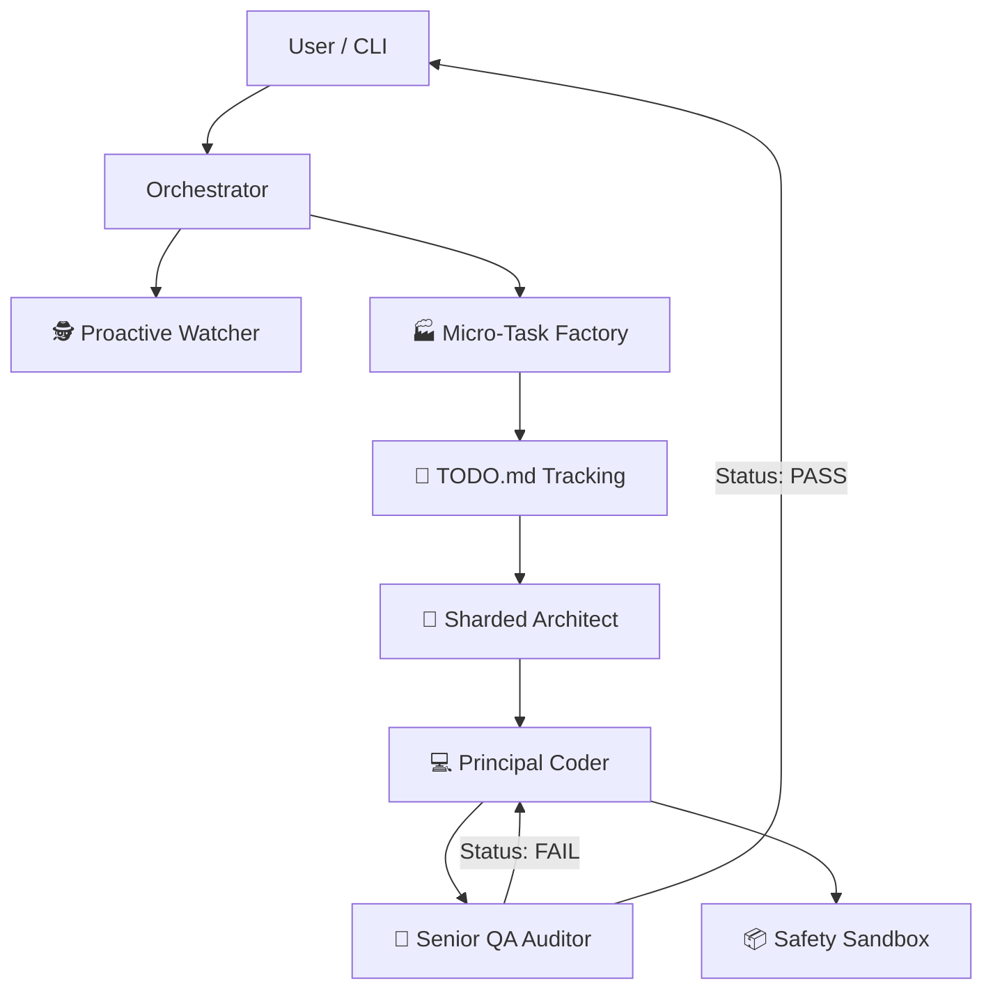

# 🤖 Deep Thinker: Turn complex ideas into production-ready code, autonomously.

**A project-aware AI swarm that plans, builds, and self-heals in any language. The only agent you need for end-to-end software engineering.**

[](https://opensource.org/licenses/MIT)
[](https://nodejs.org/)
[]()
[]()

**Deep Thinker** has evolved. Originally conceived as a Model Context Protocol (MCP) server, it is now a full-blown **Autonomous CLI Agent**. It doesn't just suggest code; it plans, architects, writes, and verifies entire projects independently via a high-performance terminal interface.

---

## 🚀 The Evolution: Beyond MCP

Deep Thinker now operates in two powerful modes:
1.  **Standalone CLI Agent**: Run `deep-think` in your terminal for a fully interactive, project-aware pair programming experience.
2.  **MCP Server**: Connect it to IDEs like **Cursor** or **VS Code** to augment your workflow with 50+ specialized tools.

---

## 🌟 Key Features

### 1. 🐝 Swarm Intelligence: The "Macro-to-Micro" Factory
Deep Thinker doesn't just write code; it operates as a high-performance software engineering team. It uses a **Macro-to-Micro Sharding** process:
- **Phase 1: Sharded Analysis (The Architect)**: Instead of a generic plan, the Architect performs a granular analysis. It identifies the tech stack and shards the project into atomic file-based instructions.
- **Phase 2: Task Splitting (The Factory)**: These macro-instructions are fed into a Task Splitter that generates a detailed `TODO.md` in your project root, mapping out every functional requirement.
- **Phase 3: Parallel Execution (The Coder)**: The Principal Coder agent executes these micro-tasks one by one. It understands context, prevents duplication (DRY), and ensures SOLID compliance.
- **Phase 4: Multi-Layer Verification (The QA)**: The QA Auditor doesn't just check syntax. it audits cross-file dependencies, verifies implementation against the Architect's design, and ensures the UI meets "Premium" standards.

### 2. 🛡️ Self-Healing "Audit-Fix" Loop
No more broken code. Our state-of-the-art **Recursive QA Loop** automatically:
- **Discovery**: Detects syntax errors, missing dependencies, and logic flaws in real-time.
- **Autonomous Recovery**: If the QA state is "FAIL", the system triggers an immediate fixing cycle. The Coder receives the audit report and corrects the code *before* it reaches the user.
- **Integrity**: Ensures that a change in one file doesn't break dependencies in another.

### 3. 🌍 Universal Polyglot Expert
Deep Thinker is an expert in **any** technology stack. It uses Dynamic Persona Switching to adapt to:
- **Frontend**: React (Hooks/Context), Angular (Standalone/RxJS), Vue.
- **Backend**: Laravel (Service Pattern/Eloquent), Node/Express (Layered Arch), Go, Rust.
- **Systems**: Python, C++, Docker, Kubernetes, Terraform.

### 4. 🧠 Semantic Memory & Project-Aware RAG
Forget context window limits. Deep Thinker indexes your entire codebase into a **Vector Store**:
- **Semantic Search**: Ask "Where did we handle JWT session expiry?" and it finds the exact logic, regardless of file name.
- **Global Context**: The agent understands the relationship between your database schema, backend services, and frontend components.

### 5. 🛠️ Industrial-Grade Tooling (50+ Specialized Tools)
Deep Thinker comes with a modular library of handlers for professional developers:
- **DevOps**: One-click Dockerization, K8s manifests, and Terraform infrastructure.
- **Security**: Autonomous source code audit and vulnerability detection.
- **Database**: Automated SQL query optimization and index suggestions.
- **Git Ops**: Intelligent PR reviews, conflict resolution, and changelog generation.

### 6. 📦 Ironclad Safety Sandbox
Every generated snippet can be tested in an isolated **Execution Sandbox** (Supports Node, Python, PHP, Bash). It verifies logic and output before saving any changes to your production files.

### 7. 🕵️ Proactive Watcher & Learning
The system doesn't just sleep. It **Start Watcher** mode:
- Monitors file changes in the background.
- Learns from your coding patterns to provide better "next-step" suggestions.
- Proactively flags potential bugs as you save files.

---

## 🛠️ Installation & Setup

### Prerequisites
- **Node.js**: v18 or higher.
- **API Key**: A Gemini API Key or OpenRouter API Key.

### 1. Quick Install
```bash
# Clone the repository
git clone https://github.com/yasinozdgnn/deep-thinker.git
cd deep-thinker

# Install dependencies
npm install

# Build/Link the CLI (Optional but recommended)
npm link
```

### 2. Configuration (`.env`)
Create a `.env` file in the root directory:
```env
# Primary API Key (Gemini)
GEMINI_API_KEY=your_key_here

# Fallback/Chat model (OpenRouter - Optional)
OPENROUTER_API_KEY=your_key_here
```

---

## 🎮 Usage

### Direct CLI Interaction
Simply run the following command to start the autonomous agent loop:
```bash
deep-think
```
*Wait for the scan to finish, then type your request (e.g., "Build a React dashboard with neon theme").*

### As an MCP Server (Cursor/VS Code)
Add this to your MCP settings:
```json
"deep-thinker": {
  "command": "node",
  "args": ["C:/path/to/deep-thinker/index.js"]
}
```

---

## 🏗️ Technical Architecture



---

## 📋 All Tools (83+ Specialized)

| Category | Tools |
|----------|-------|
| 🎯 **Core** | `deep_think_chat`, `deep_think_code`, `ask_question`, `analyze_task`, `detect_tool` |
| 📁 **File Ops** | `read_file`, `write_file`, `list_directory`, `analyze_directory`, `search_in_files` |
| 🔍 **Code Analysis** | `read_project`, `explain_code`, `find_bugs`, `security_scan`, `optimize_code`, `generate_tests`, `generate_docs`, `refactor_code` |
| 🐙 **Git Ops** | `git_commit`, `git_push`, `git_pull`, `git_status`, `git_diff`, `git_branch`, `git_log`, `git_init` |
| 🧪 **Testing** | `run_tests`, `generate_test_suite`, `validate_html`, `validate_json`, `lint_code` |
| 🗄️ **Database** | `database_schema`, `optimize_query`, `generate_migration`, `seed_database`, `generate_indexes` |
| 🚢 **DevOps** | `dockerize`, `generate_k8s_manifest`, `generate_terraform`, `ci_cd_pipeline`, `monitoring_config` |
| 🔒 **Security** | `security_audit`, `vulnerability_scan`, `dependency_check`, `secret_scan`, `cors_check` |
| 📡 **API** | `api_design`, `generate_api_doc`, `test_endpoint`, `mock_api` |
| 🏗️ **Project** | `create_project`, `project_analysis`, `dependency_graph`, `project_health` |
| 🤖 **Agent** | `plan_task`, `execute_plan`, `execute_mission`, `decompose_task`, `list_workflows`, `run_workflow`, `remember`, `recall`, `get_insights`, `execute_parallel`, `get_strategy_suggestion`, `analyze_performance` |
| 📐 **Architect** | `design_system`, `analyze_architecture`, `generate_blueprint`, `visualize_architecture`, `get_blueprint_summary` |
| 🐝 **Swarm** | `delegate_to_swarm` (multi-agent orchestration) |
| 🧠 **Memory** | `index_codebase`, `semantic_search` |
| 👁️ **Watcher** | `start_watcher`, `stop_watcher`, `watcher_status` |
| 🏖️ **Sandbox** | `run_in_sandbox` (JS/Python/Bash/TS/PHP) |
| 🚀 **OpenCode** | `opencode_run`, `opencode_run_with_thinking`, `opencode_go_run` |

## 🤖 Agent Architecture & Communication

### Agents

| Agent | Role | Responsibility |
|-------|------|----------------|
| 🧠 **AgentCoordinator** | Orchestrator | Manages all agents, distributes tasks |
| 🏗️ **AgentPool** | Worker Pool | 5 parallel agents, queuing, retries |
| 📐 **Architect Agent** | System Designer | Multi-layered analysis, blueprint, tech stack selection |
| 👨‍💻 **Coder Agent (Codey)** | Principal Engineer | Code generation, feedback loop, SOLID/DRY compliance |
| 🧪 **QA Agent (Tester)** | QA Auditor | Code audit, dependency analysis, runtime testing |
| 🧩 **Task Splitter** | Micro-Task Factory | Splits macro tasks into atomic tasks, generates TODO.md |
| 👁️ **Proactive Watcher** | File Monitor | Monitors file changes, auto-checks |
| 🛡️ **Self-Heal Engine** | Auto-Repair | Self-healing loop, error correction |

### Inter-Agent Communication (Swarm Pipeline)

```
User
  │
  ▼
┌─────────────────────────────────────────────────────┐
│  🧠 AgentCoordinator / ToolOrchestrator              │
│  • Task decomposition (TaskDecomposer)               │
│  • Parallel execution (AgentPool)                    │
│  • Circuit Breaker + Retry mechanism                 │
│  • Validation engine                                 │
└─────────────────────────────────────────────────────┘
  │
  ├── 📐 ARCHITECT PHASE ─────────────────────────────┐
  │  1. Task analysis (sharded/multi-layer)            │
  │  2. Tech stack selection                            │
  │  3. Blueprint generation (components, API, DB)     │
  │  4. ARCHITECTURE.md saved                           │
  └────────────────────────────────────────────────────┘
  │
  ├── 🏭 TASK SPLITTER (Micro-Task Factory) ─────────┐
  │  1. Macro steps → atomic tasks                     │
  │  2. TODO.md generation (progress tracking)         │
  └────────────────────────────────────────────────────┘
  │
  ├── 👨‍💻 CODER PHASE (Micro-Task Loop) ──────────────┐
  │  For each atomic task:                              │
  │  1. Coder generates code from blueprint + context   │
  │  2. ⬅️ FEEDBACK: Coder → Architect                 │
  │     (design flaws are reported back)                │
  │  3. Files saved                                     │
  │  4. TODO.md updated                                 │
  └────────────────────────────────────────────────────┘
  │
  ├── 🧪 QA PHASE ────────────────────────────────────┐
  │  1. Dependency audit (import/require/href/src)     │
  │  2. Runtime testing (sandbox execution)             │
  │  3. AI-powered code quality analysis               │
  │  4. ⬅️ FEEDBACK: QA → Architect / QA → Coder       │
  │     (HIGH severity issues auto-fixed)              │
  └────────────────────────────────────────────────────┘
  │
  └── 🛡️ SELF-HEAL ──────────────────────────────────┐
      1. File integrity check                           │
      2. Missing file auto-regeneration                 │
      3. Final report generation                        │
      └─────────────────────────────────────────────────┘
```

### Swarm Feedback Mechanism

```
📐 Architect → Blueprint
     │
     ▼
👨‍💻 Coder: "Design has a flaw! Need to change..."
     │ feedback (target: 'architect')
     ▼
📐 Architect: Blueprint revised
     │
     ▼
👨‍💻 Coder: Continues with revised blueprint
     │
     ▼
🧪 QA: "Code 10/10, all checks passed!"
     |
     ├─ NO ERRORS → Final report
     └─ HIGH SEVERITY ISSUE → 
          QA → Coder: "critical fix needed"
          Coder fixes the issue
          QA re-audits
```

## 🚀 CLI Usage (Running on Your Computer)

### Option 1: `deep-think` command (Recommended)
```bash
# In project directory
cd ~/Desktop/deep-thinker

# Make it a global command
npm link

# Now use from anywhere:
deep-think
# Or one-shot:
deep-think "Build a login page for me"
```

### Option 2: Direct `node` (no npm link needed)
```bash
cd ~/Desktop/deep-thinker

# Interactive mode:
/usr/local/bin/node bin/cli.js

# One-shot command:
/usr/local/bin/node bin/cli.js "Build a login page for me"
```

### Option 3: Full Node.js path (if node not in PATH)
```bash
cd ~/Desktop/deep-thinker && /usr/local/bin/node bin/cli.js
```

### .env Configuration
```env
# ZEN API (recommended - free)
AI_PROVIDER=zen
ZEN_API_KEY=sk-xxx...n
ZEN_MODEL=deepseek-v4-flash-free

# Or OpenRouter:
# AI_PROVIDER=openrouter
# OPENROUTER_API_KEY=sk-xxx...
```

### Testing & Verification
```bash
# API connection test
/usr/local/bin/node test_live.js

# Swarm (multi-agent) test:
/usr/local/bin/node -e "
import { executeToolLogic } from './index.js';
const r = await executeToolLogic('delegate_to_swarm', {
  task: 'Create a hello.html file',
  projectPath: process.cwd()
});
console.log(JSON.stringify(r));
"

# Full system test:
/usr/local/bin/node test_full.js
```

## 🇹🇷 Türkçe Dil Desteği (Turkish Support)
Deep Thinker understands Turkish commands and intentions autonomously. Commands like "Bana bir giriş ekranı yap" (Build a login page) or "Kodu düzelt" (Fix the code) are processed directly.

---

## 🧪 Test Report (Jun 08, 2026)

| Test | Status | Details |
|------|--------|---------|
| ✅ `test_live.js` (API connection) | ✅ 26.1s | Zen API (deepseek-v4-flash-free) |
| ✅ Login page generation (CLI) | ✅ 45.7s | login-demo.html (520 lines) |
| ✅ Swarm (Architect + Coder + QA) | ✅ 100s | selam.html, 10/10 QA score |
| ✅ Tool detection | ✅ 83 tools loaded | All categories available |
| ✅ OpenCode tools | ✅ 3 tools | opencode_run, +thinking, go_run |
| ⚠️ Go sandbox | ➖ Go not installed | Environment issue, not code bug |

---
