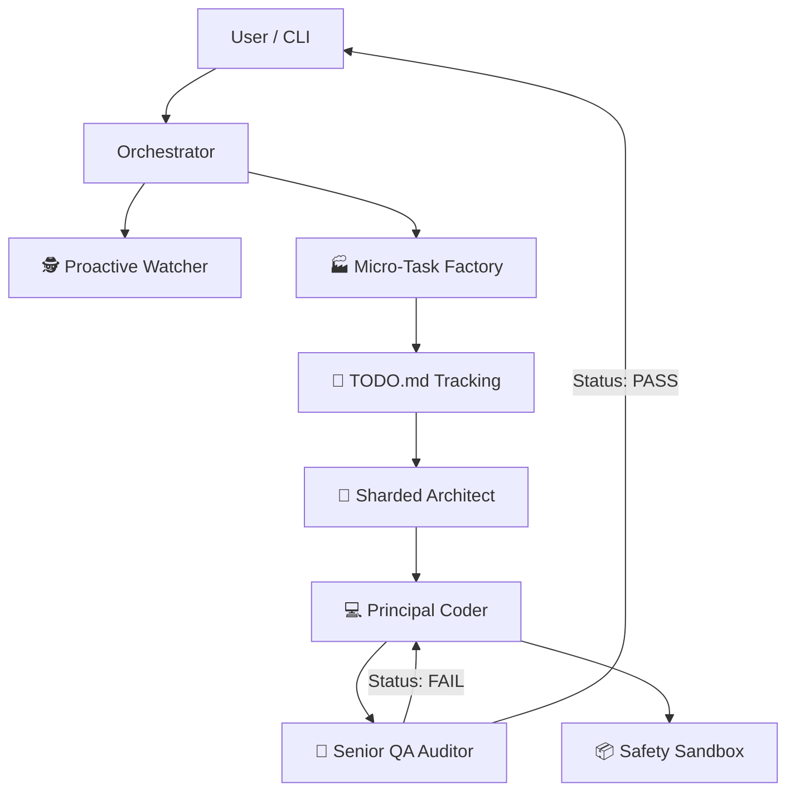

# 🤖 Deep Thinker: The Autonomous CLI Agent & MCP Powerhouse

[](https://opensource.org/licenses/MIT)
[](https://nodejs.org/)
[]()
[]()

**Deep Thinker** has evolved. Originally conceived as a Model Context Protocol (MCP) server, it is now a full-blown **Autonomous CLI Agent**. It doesn't just suggest code; it plans, architects, writes, and verifies entire projects independently via a high-performance terminal interface.

---

## 🚀 The Evolution: Beyond MCP

Deep Thinker now operates in two powerful modes:
1.  **Standalone CLI Agent**: Run `deep-think` in your terminal for a fully interactive, project-aware pair programming experience.
2.  **MCP Server**: Connect it to IDEs like **Cursor** or **VS Code** to augment your workflow with 50+ specialized tools.

---

## 🌟 Key Features

### 1. 🐝 Swarm Intelligence: The "Macro-to-Micro" Factory
Deep Thinker doesn't just write code; it operates as a high-performance software engineering team. It uses a **Macro-to-Micro Sharding** process:
- **Phase 1: Sharded Analysis (The Architect)**: Instead of a generic plan, the Architect performs a granular analysis. It identifies the tech stack and shards the project into atomic file-based instructions.
- **Phase 2: Task Splitting (The Factory)**: These macro-instructions are fed into a Task Splitter that generates a detailed `TODO.md` in your project root, mapping out every functional requirement.
- **Phase 3: Parallel Execution (The Coder)**: The Principal Coder agent executes these micro-tasks one by one. It understands context, prevents duplication (DRY), and ensures SOLID compliance.
- **Phase 4: Multi-Layer Verification (The QA)**: The QA Auditor doesn't just check syntax. it audits cross-file dependencies, verifies implementation against the Architect's design, and ensures the UI meets "Premium" standards.

### 2. 🛡️ Self-Healing "Audit-Fix" Loop
No more broken code. Our state-of-the-art **Recursive QA Loop** automatically:
- **Discovery**: Detects syntax errors, missing dependencies, and logic flaws in real-time.
- **Autonomous Recovery**: If the QA state is "FAIL", the system triggers an immediate fixing cycle. The Coder receives the audit report and corrects the code *before* it reaches the user.
- **Integrity**: Ensures that a change in one file doesn't break dependencies in another.

### 3. 🌍 Universal Polyglot Expert
Deep Thinker is an expert in **any** technology stack. It uses Dynamic Persona Switching to adapt to:
- **Frontend**: React (Hooks/Context), Angular (Standalone/RxJS), Vue.
- **Backend**: Laravel (Service Pattern/Eloquent), Node/Express (Layered Arch), Go, Rust.
- **Systems**: Python, C++, Docker, Kubernetes, Terraform.

### 4. 🧠 Semantic Memory & Project-Aware RAG
Forget context window limits. Deep Thinker indexes your entire codebase into a **Vector Store**:
- **Semantic Search**: Ask "Where did we handle JWT session expiry?" and it finds the exact logic, regardless of file name.
- **Global Context**: The agent understands the relationship between your database schema, backend services, and frontend components.

### 5. 🛠️ Industrial-Grade Tooling (50+ Specialized Tools)
Deep Thinker comes with a modular library of handlers for professional developers:
- **DevOps**: One-click Dockerization, K8s manifests, and Terraform infrastructure.
- **Security**: Autonomous source code audit and vulnerability detection.
- **Database**: Automated SQL query optimization and index suggestions.
- **Git Ops**: Intelligent PR reviews, conflict resolution, and changelog generation.

### 6. 📦 Ironclad Safety Sandbox
Every generated snippet can be tested in an isolated **Execution Sandbox** (Supports Node, Python, PHP, Bash). It verifies logic and output before saving any changes to your production files.

### 7. 🕵️ Proactive Watcher & Learning
The system doesn't just sleep. It **Start Watcher** mode:
- Monitors file changes in the background.
- Learns from your coding patterns to provide better "next-step" suggestions.
- Proactively flags potential bugs as you save files.

---

## 🛠️ Installation & Setup

### Prerequisites
- **Node.js**: v18 or higher.
- **API Key**: A Gemini API Key or OpenRouter API Key.

### 1. Quick Install
```bash
# Clone the repository
git clone https://github.com/yasinozdgnn/deep-thinker.git
cd deep-thinker

# Install dependencies
npm install

# Build/Link the CLI (Optional but recommended)
npm link
```

### 2. Configuration (`.env`)
Create a `.env` file in the root directory:
```env
# Primary API Key (Gemini)
GEMINI_API_KEY=your_key_here

# Fallback/Chat model (OpenRouter - Optional)
OPENROUTER_API_KEY=your_key_here
```

---

## 🎮 Usage

### Direct CLI Interaction
Simply run the following command to start the autonomous agent loop:
```bash
deep-think
```
*Wait for the scan to finish, then type your request (e.g., "Build a React dashboard with neon theme").*

### As an MCP Server (Cursor/VS Code)
Add this to your MCP settings:
```json
"deep-thinker": {
  "command": "node",
  "args": ["C:/path/to/deep-thinker/index.js"]
}
```

---

## 🏗️ Technical Architecture



---

## 🇹🇷 Türkçe Dil Desteği (Turkish Support)
Deep Thinker, Türkçe komutları ve niyetlerini (intent) otonom olarak anlar. "Bana bir giriş ekranı yap" veya "Kodu düzelt" gibi komutları doğrudan işleyebilir.

---

## 📄 License
MIT © 2026 - [Yasin Ozdogan](https://github.com/yasinozdgnn)
