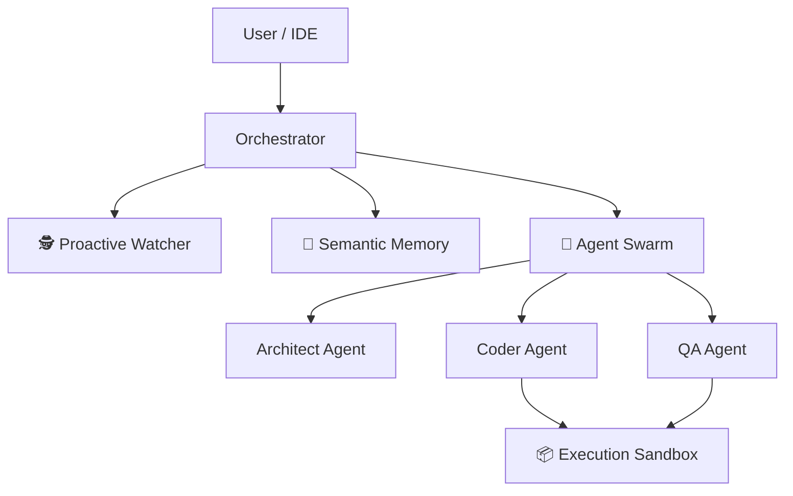

# Deep-Thinker MCP - The fully Autonomous Coder Agent 🚀

**Deep-Thinker MCP** is a revolutionary [Model Context Protocol](https://github.com/modelcontextprotocol) server that transforms your IDE (Cursor, VS Code, etc.) into an **Autonomous Coding Powerhouse**.

Unlike traditional tools that just wait for commands, Deep-Thinker **plans, executes, learns, and proactively watches** your codebase. It combines the power of **GLM-4** with a sophisticated agentic architecture.

[](https://opensource.org/licenses/MIT)
[](https://nodejs.org/)
[]()

> "Not just a coding assistant. A proactive software engineer living in your editor."

---

## 🌟 Why is this a "Game Changer"?

Most AI coding tools are **Reactive**: You ask, they answer.
Deep-Thinker is **Proactive & Autonomous**:

1.  **It Thinks:** Breaks down complex tasks into subtasks (`Task Decomposition`).
2.  **It Remembers:** Understands your project's _intent_ via Semantic Memory.
3.  **It Collaborates:** Spawns a "Swarm" of specialized agents (Architect, Coder, QA).
4.  **It Watches:** Monitors your files and auto-fixes issues as you type.

---

## 🚀 Key Capabilities

### 1. 🐝 Swarm Architecture (Multi-Agent System)

Why rely on one AI when you can have a team?

- **Architect Agent**: Designs the solution structure.
- **Coder Agent**: Implements the code based on the design.
- **QA Agent**: Writes tests and verifies the code.

```bash
# Example
Use delegate_to_swarm to "Implement a full auth system with JWT"
# Result: The swarm designs, builds, and tests the entire feature autonomously.
```

### 2. 🧠 Semantic Memory (RAG-Lite)

Forget "context window" limits. Deep-Thinker remembers your entire codebase's _meaning_.

- **`index_codebase`**: Scans and "understands" your project.
- **`semantic_search`**: Ask "Where is the payment validation logic?" and it finds it, even if the file is named `foo.js`.

### 3. 📦 Execution Sandbox

No more broken code. Deep-Thinker tests its own code before giving it to you.

- **`run_in_sandbox`**: Safely executes generated snippets (Node.js, python, etc.) in an isolated environment to verify correctness.

### 4. 🕵️ Proactive Watcher

Your silent partner.

- **`start_watcher`**: Runs in the background.
- Detects changes, runs syntax checks, security scans, or tests automatically when you save a file.

---

## 🛠️ Installation

```bash
# 1. Clone the repo
git clone https://github.com/yasinozdgnn/deep-thinker.git
cd glm-think-mcp

# 2. Install dependencies
npm install

# 3. Configure API Key
# Get your key from https://api.z.ai
```

### Add to Cursor (Settings > Features > MCP)

```json
{
  "deep-thinking": {
    "command": "node",
    "args": ["C:/path/to/glm-think-mcp/index.js"],
    "env": {
      "GLM_API_KEY": "YOUR_API_KEY_HERE"
    }
  }
}
```

---

## 📚 50+ Specialized Tools

Features a modular architecture with specialized handlers:

| Category       | Tools                                                                |
| -------------- | -------------------------------------------------------------------- |
| **Autonomous** | `delegate_to_swarm`, `plan_task`, `auto_detect`                      |
| **Architect**  | `design_system`, `analyze_architecture`, `visualize_architecture`    |
| **Memory**     | `index_codebase`, `semantic_search`                                  |
| **Watcher**    | `start_watcher`, `stop_watcher`, `watcher_status`                    |
| **Execution**  | `run_in_sandbox`                                                     |
| **Coding**     | `deep_think_code`, `refactor_code`, `find_bugs` (Auto-Fix)           |
| **DevOps**     | `generate_dockerfile`, `k8s_manifest`, `terraform_module`            |
| **DB & Git**   | `analyze_query`, `suggest_indexes`, `pr_review`, `resolve_conflicts` |

---

## 🛡️ Industrial Stability

Built for reliability in production environments:

- **Crash Prevention**: Global error handlers prevent server crashes on critical errors.
- **Zombie Process Protection**: Replaces `stdout` logs with safe `stderr` channels to keep JSON-RPC connection stable.
- **Defensive Data Handling**: "Airbag" logic ensures the system keeps running even if agents generate incomplete data.
- **Path Validation**: Smart validation prevents file system errors before they happen.

---

## 🏗️ Architecture



---

## 🤝 Contributing

We are building the future of AI coding. PRs are welcome!

1. Fork the repo.
2. Create your feature branch (`git checkout -b feature/amazing-feature`).
3. Commit your changes.
4. Push to the branch.
5. Open a Pull Request.

---

## License

MIT © 2026
