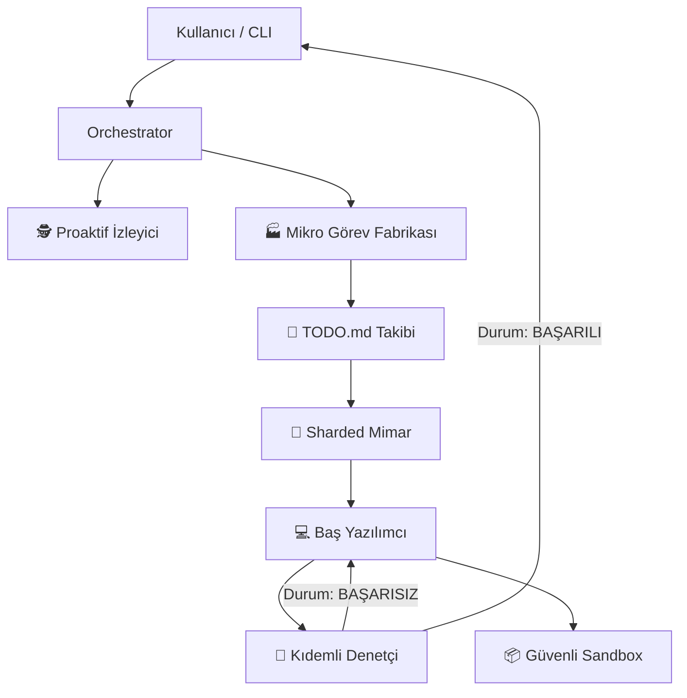

# 🤖 Deep Thinker: Karmaşık fikirleri otonom olarak üretime hazır koda dönüştürün.

**Her dilde planlayan, kuran ve kendi kendini iyileştiren proje farkındalıklı AI sürüsü. Uçtan uca yazılım mühendisliği için ihtiyacınız olan tek ajan.**

[](https://opensource.org/licenses/MIT)
[](https://nodejs.org/)
[]()
[]()

**Deep Thinker** artık sadece bir MCP sunucusu değil; tam donanımlı bir **Otonom CLI Ajanı**'na dönüştü. Sadece kod önermekle kalmaz; yüksek performanslı bir terminal arayüzü üzerinden projeleri bağımsız olarak planlar, mimarisini kurar, kodlar ve doğrular.

---

## 🚀 Evrim: MCP'nin Ötesinde

Deep Thinker artık iki güçlü modda çalışıyor:
1.  **Bağımsız CLI Ajanı**: Terminalinizde `deep-think` komutunu çalıştırarak, proje farkındalığına sahip tam etkileşimli bir "Pair Programming" deneyimi yaşayın.
2.  **MCP Sunucusu**: **Cursor** veya **VS Code** gibi IDE'lere bağlayarak iş akışınızı 50'den fazla uzmanlaşmış araçla güçlendirin.

---

## 🌟 Öne Çıkan Özellikler

### 1. 🐝 Swarm (Sürü) Zekası: "Makrodan Mikroya" Fabrikası
Deep Thinker sadece kod yazmaz; yüksek performanslı bir yazılım mühendisliği ekibi gibi çalışır. **"Macro-to-Micro Sharding"** (Makrodan Mikroya Parçalama) adı verilen özel bir süreç kullanır:
- **Aşama 1: Parçalı Analiz (Mimar)**: Mimar, genel bir plan yerine çok katmanlı bir analiz yapar. Teknoloji yığınını belirler ve projeyi dosya bazlı atomik talimatlara böler.
- **Aşama 2: Görev Bölümleme (Fabrika)**: Bu makro talimatlar, bir Görev Bölücüye (Task Splitter) gönderilir. Bu bölücü, proje kök dizininizde her fonksiyonel gereksinimi haritalayan detaylı bir `TODO.md` dosyası oluşturur.
- **Aşama 3: Paralel Yürütme (Yazılımcı)**: Baş Yazılımcı (Coder) ajanı, bu mikro görevleri sırayla yürütür. Bağlamı (context) anlar, kod tekrarını (DRY) önler ve SOLID prensiplerine tam uyum sağlar.
- **Aşama 4: Çok Katmanlı Doğrulama (QA)**: QA denetçisi sadece sözdizimini kontrol etmez; dosyalar arası bağımlılıkları denetler, uygulamanın mimari tasarıma uygunluğunu doğrular ve UI'ın "Premium" standartlarda olduğunu garanti eder.

### 2. 🛡️ Kendi Kendini İyileştiren (Self-Healing) Denetim Döngüsü
Artık bozuk kodlara son. Gelişmiş **Rekürsif QA Döngümüz** şunları otomatik yapar:
- **Hata Tespiti**: Sözdizimi hatalarını, eksik bağımlılıkları ve mantık hatalarını gerçek zamanlı olarak bulur.
- **Otonom Kurtarma**: Eğer QA raporu "BAŞARISIZ" dönerse, sistem anında bir düzeltme döngüsü başlatır. Yazılımcı denetim raporunu alır ve hataları siz daha görmeden düzeltir.
- **Bütünlük**: Bir dosyadaki değişikliğin başka bir dosyadaki bağımlılıkları bozmadığından emin olur.

### 3. 🌍 Evrensel Poliglot Uzmanlık
Deep Thinker, **herhangi bir** teknoloji yığınında uzmandır. Dinamik Kimlik Değişimi ile her ortama uyum sağlar:
- **Frontend**: React (Hooks/Context), Angular (Standalone/RxJS), Vue.
- **Backend**: Laravel (Service Pattern/Eloquent), Node/Express (Layered Arch), Go, Rust.
- **Sistem**: Python, C++, Docker, Kubernetes, Terraform.

### 4. 🧠 Semantik Bellek ve Proje Farkındalığı (RAG)
Bağlam penceresi (context window) sınırlarını unutun. Deep Thinker, tüm kod tabanınızı bir **Vektör Veritabanına** endeksler:
- **Semantik Arama**: "JWT oturum süresini nerede kontrol ediyoruz?" diye sorun; dosya adından bağımsız olarak ilgili mantığı anında bulur.
- **Küresel Bağlam**: Ajan; veritabanı şemanız, backend servisleriniz ve frontend bileşenleriniz arasındaki ilişkiyi profesyonel bir mühendis gibi anlar.

### 5. 🛠️ Endüstriyel Seviye Araçlar (50+ Uzman Araç)
Deep Thinker, profesyonel geliştiriciler için modüler bir araç kütüphanesiyle birlikte gelir:
- **DevOps**: Tek tıkla Dockerize etme, Kube manifestleri ve Terraform altyapı kodları.
- **Güvenlik (Security)**: Otonom kaynak kod denetimi ve güvenlik açığı tespiti.
- **Veritabanı (Database)**: Otomatik SQL sorgu optimizasyonu ve indeks önerileri.
- **Git Ops**: Akıllı PR incelemeleri, çakışma (conflict) çözümü ve otomatik changelog üretimi.

### 6. 📦 Güvenli İzole Sandbox (Sandbox)
Üretilen her kod parçası, izole bir **Çalıştırma Sandbox'ında** (Node, Python, PHP, Bash desteğiyle) test edilebilir. Üretim dosyalarınıza kaydedilmeden önce mantık ve çıktı doğrulaması yapılır.

### 7. 🕵️ Proaktif İzleyici ve Öğrenme
Sistem asla uyumaz. **Start Watcher** modunda:
- Arka planda dosya değişikliklerini izler.
- Kod yazım alışkanlıklarınızdan öğrenerek daha iyi "bir sonraki adım" önerileri sunar.
- Dosyaları kaydettiğinizde otonom olarak potansiyel hataları (bug) bayraklar.

---

## 🛠️ Kurulum ve Yapılandırma

### Gereksinimler
- **Node.js**: v18 veya üzeri.
- **API Anahtarı**: Gemini API Anahtarı veya OpenRouter API Anahtarı.

### 1. Hızlı Kurulum
```bash
# Depoyu klonlayın
git clone https://github.com/yasinozdgnn/deep-thinker.git
cd deep-thinker

# Bağımlılıkları yükleyin
npm install

# CLI'ı Bağlayın (Önerilen)
npm link
```

### 2. Yapılandırma (`.env`)
Kök dizinde bir `.env` dosyası oluşturun:
```env
# Birincil API Anahtarı (Gemini)
GEMINI_API_KEY=anahtariniz_buraya

# İkincil/Sohbet Modeli (OpenRouter - İsteğe Bağlı)
OPENROUTER_API_KEY=anahtariniz_buraya
```

---

## 🎮 Kullanım

### Doğrudan CLI Etkileşimi
Otonom ajan döngüsünü başlatmak için şu komutu çalıştırmanız yeterlidir:
```bash
deep-think
```
*Taramanın bitmesini bekleyin, ardından isteğinizi yazın (örn: "Neon temalı bir React dashboard yap").*

### MCP Sunucusu Olarak (Cursor/VS Code)
IDE ayarlarınıza şunu ekleyin:
```json
"deep-thinker": {
  "command": "node",
  "args": ["C:/path/to/deep-thinker/index.js"]
}
```

---

## 🏗️ Teknik Mimari



---

## 📄 Lisans
MIT © 2026 - [Yasin Ozdogan](https://github.com/yasinozdgnn)
