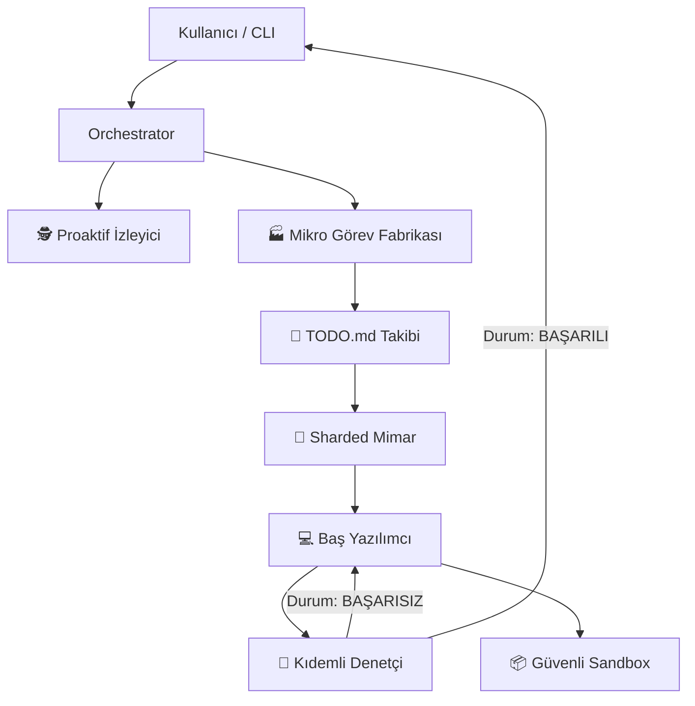

# 🤖 Deep Thinker: Karmaşık fikirleri otonom olarak üretime hazır koda dönüştürün.

**Her dilde planlayan, kuran ve kendi kendini iyileştiren proje farkındalıklı AI sürüsü. Uçtan uca yazılım mühendisliği için ihtiyacınız olan tek ajan.**

[](https://opensource.org/licenses/MIT)
[](https://nodejs.org/)
[]()
[]()

**Deep Thinker** artık sadece bir MCP sunucusu değil; tam donanımlı bir **Otonom CLI Ajanı**'na dönüştü. Sadece kod önermekle kalmaz; yüksek performanslı bir terminal arayüzü üzerinden projeleri bağımsız olarak planlar, mimarisini kurar, kodlar ve doğrular.

---

## 🚀 Evrim: MCP'nin Ötesinde

Deep Thinker artık iki güçlü modda çalışıyor:
1.  **Bağımsız CLI Ajanı**: Terminalinizde `deep-think` komutunu çalıştırarak, proje farkındalığına sahip tam etkileşimli bir "Pair Programming" deneyimi yaşayın.
2.  **MCP Sunucusu**: **Cursor** veya **VS Code** gibi IDE'lere bağlayarak iş akışınızı 50'den fazla uzmanlaşmış araçla güçlendirin.

---

## 🌟 Öne Çıkan Özellikler

### 1. 🐝 Swarm (Sürü) Zekası: "Makrodan Mikroya" Fabrikası
Deep Thinker sadece kod yazmaz; yüksek performanslı bir yazılım mühendisliği ekibi gibi çalışır. **"Macro-to-Micro Sharding"** (Makrodan Mikroya Parçalama) adı verilen özel bir süreç kullanır:
- **Aşama 1: Parçalı Analiz (Mimar)**: Mimar, genel bir plan yerine çok katmanlı bir analiz yapar. Teknoloji yığınını belirler ve projeyi dosya bazlı atomik talimatlara böler.
- **Aşama 2: Görev Bölümleme (Fabrika)**: Bu makro talimatlar, bir Görev Bölücüye (Task Splitter) gönderilir. Bu bölücü, proje kök dizininizde her fonksiyonel gereksinimi haritalayan detaylı bir `TODO.md` dosyası oluşturur.
- **Aşama 3: Paralel Yürütme (Yazılımcı)**: Baş Yazılımcı (Coder) ajanı, bu mikro görevleri sırayla yürütür. Bağlamı (context) anlar, kod tekrarını (DRY) önler ve SOLID prensiplerine tam uyum sağlar.
- **Aşama 4: Çok Katmanlı Doğrulama (QA)**: QA denetçisi sadece sözdizimini kontrol etmez; dosyalar arası bağımlılıkları denetler, uygulamanın mimari tasarıma uygunluğunu doğrular ve UI'ın "Premium" standartlarda olduğunu garanti eder.

### 2. 🛡️ Kendi Kendini İyileştiren (Self-Healing) Denetim Döngüsü
Artık bozuk kodlara son. Gelişmiş **Rekürsif QA Döngümüz** şunları otomatik yapar:
- **Hata Tespiti**: Sözdizimi hatalarını, eksik bağımlılıkları ve mantık hatalarını gerçek zamanlı olarak bulur.
- **Otonom Kurtarma**: Eğer QA raporu "BAŞARISIZ" dönerse, sistem anında bir düzeltme döngüsü başlatır. Yazılımcı denetim raporunu alır ve hataları siz daha görmeden düzeltir.
- **Bütünlük**: Bir dosyadaki değişikliğin başka bir dosyadaki bağımlılıkları bozmadığından emin olur.

### 3. 🌍 Evrensel Poliglot Uzmanlık
Deep Thinker, **herhangi bir** teknoloji yığınında uzmandır. Dinamik Kimlik Değişimi ile her ortama uyum sağlar:
- **Frontend**: React (Hooks/Context), Angular (Standalone/RxJS), Vue.
- **Backend**: Laravel (Service Pattern/Eloquent), Node/Express (Layered Arch), Go, Rust.
- **Sistem**: Python, C++, Docker, Kubernetes, Terraform.

### 4. 🧠 Semantik Bellek ve Proje Farkındalığı (RAG)
Bağlam penceresi (context window) sınırlarını unutun. Deep Thinker, tüm kod tabanınızı bir **Vektör Veritabanına** endeksler:
- **Semantik Arama**: "JWT oturum süresini nerede kontrol ediyoruz?" diye sorun; dosya adından bağımsız olarak ilgili mantığı anında bulur.
- **Küresel Bağlam**: Ajan; veritabanı şemanız, backend servisleriniz ve frontend bileşenleriniz arasındaki ilişkiyi profesyonel bir mühendis gibi anlar.

### 5. 🛠️ Endüstriyel Seviye Araçlar (50+ Uzman Araç)
Deep Thinker, profesyonel geliştiriciler için modüler bir araç kütüphanesiyle birlikte gelir:
- **DevOps**: Tek tıkla Dockerize etme, Kube manifestleri ve Terraform altyapı kodları.
- **Güvenlik (Security)**: Otonom kaynak kod denetimi ve güvenlik açığı tespiti.
- **Veritabanı (Database)**: Otomatik SQL sorgu optimizasyonu ve indeks önerileri.
- **Git Ops**: Akıllı PR incelemeleri, çakışma (conflict) çözümü ve otomatik changelog üretimi.

### 6. 📦 Güvenli İzole Sandbox (Sandbox)
Üretilen her kod parçası, izole bir **Çalıştırma Sandbox'ında** (Node, Python, PHP, Bash desteğiyle) test edilebilir. Üretim dosyalarınıza kaydedilmeden önce mantık ve çıktı doğrulaması yapılır.

### 7. 🕵️ Proaktif İzleyici ve Öğrenme
Sistem asla uyumaz. **Start Watcher** modunda:
- Arka planda dosya değişikliklerini izler.
- Kod yazım alışkanlıklarınızdan öğrenerek daha iyi "bir sonraki adım" önerileri sunar.
- Dosyaları kaydettiğinizde otonom olarak potansiyel hataları (bug) bayraklar.

---

## 🛠️ Kurulum ve Yapılandırma

### Gereksinimler
- **Node.js**: v18 veya üzeri.
- **API Anahtarı**: Gemini API Anahtarı veya OpenRouter API Anahtarı.

### 1. Hızlı Kurulum
```bash
# Depoyu klonlayın
git clone https://github.com/yasinozdgnn/deep-thinker.git
cd deep-thinker

# Bağımlılıkları yükleyin
npm install

# CLI'ı Bağlayın (Önerilen)
npm link
```

### 2. Yapılandırma (`.env`)
Kök dizinde bir `.env` dosyası oluşturun:
```env
# Birincil API Anahtarı (Gemini)
GEMINI_API_KEY=anahtariniz_buraya

# İkincil/Sohbet Modeli (OpenRouter - İsteğe Bağlı)
OPENROUTER_API_KEY=anahtariniz_buraya
```

---

## 🎮 Kullanım

### Doğrudan CLI Etkileşimi
Otonom ajan döngüsünü başlatmak için şu komutu çalıştırmanız yeterlidir:
```bash
deep-think
```
*Taramanın bitmesini bekleyin, ardından isteğinizi yazın (örn: "Neon temalı bir React dashboard yap").*

### MCP Sunucusu Olarak (Cursor/VS Code)
IDE ayarlarınıza şunu ekleyin:
```json
"deep-thinker": {
  "command": "node",
  "args": ["C:/path/to/deep-thinker/index.js"]
}
```

---

## 🏗️ Teknik Mimari



---

## 📋 Tüm Tool'lar (83+ Uzman Araç)

| Kategori | Araçlar |
|----------|---------|
| 🎯 **Core** | `deep_think_chat`, `deep_think_code`, `ask_question`, `analyze_task`, `detect_tool` |
| 📁 **File Ops** | `read_file`, `write_file`, `list_directory`, `analyze_directory`, `search_in_files` |
| 🔍 **Code Analysis** | `read_project`, `explain_code`, `find_bugs`, `security_scan`, `optimize_code`, `generate_tests`, `generate_docs`, `refactor_code` |
| 🐙 **Git Ops** | `git_commit`, `git_push`, `git_pull`, `git_status`, `git_diff`, `git_branch`, `git_log`, `git_init` |
| 🧪 **Testing** | `run_tests`, `generate_test_suite`, `validate_html`, `validate_json`, `lint_code` |
| 🗄️ **Database** | `database_schema`, `optimize_query`, `generate_migration`, `seed_database`, `generate_indexes` |
| 🚢 **DevOps** | `dockerize`, `generate_k8s_manifest`, `generate_terraform`, `ci_cd_pipeline`, `monitoring_config` |
| 🔒 **Security** | `security_audit`, `vulnerability_scan`, `dependency_check`, `secret_scan`, `cors_check` |
| 📡 **API** | `api_design`, `generate_api_doc`, `test_endpoint`, `mock_api` |
| 🏗️ **Project** | `create_project`, `project_analysis`, `dependency_graph`, `project_health` |
| 🤖 **Agent** | `plan_task`, `execute_plan`, `execute_mission`, `decompose_task`, `list_workflows`, `run_workflow`, `remember`, `recall`, `get_insights`, `execute_parallel`, `get_strategy_suggestion`, `analyze_performance` |
| 📐 **Architect** | `design_system`, `analyze_architecture`, `generate_blueprint`, `visualize_architecture`, `get_blueprint_summary` |
| 🐝 **Swarm** | `delegate_to_swarm` (çoklu-ajan orchestrasyonu) |
| 🧠 **Memory** | `index_codebase`, `semantic_search` |
| 👁️ **Watcher** | `start_watcher`, `stop_watcher`, `watcher_status` |
| 🏖️ **Sandbox** | `run_in_sandbox` (JS/Python/Bash/TS/PHP) |
| 🚀 **OpenCode** | `opencode_run`, `opencode_run_with_thinking`, `opencode_go_run` |

## 🤖 Ajan Mimarisi ve İletişim

### Ajanlar

| Ajan | Rol | Sorumluluk |
|------|-----|------------|
| 🧠 **AgentCoordinator** | Orchestrator | Tüm ajanları yönetir, görevleri dağıtır |
| 🏗️ **AgentPool** | Worker Pool | 5 paralel ajan yönetir, kuyruklama yapar |
| 📐 **Architect Agent** | System Designer | Çok katmanlı analiz, blueprint oluşturma, tech stack seçimi |
| 👨‍💻 **Coder Agent (Codey)** | Principal Engineer | Kod üretimi, feedback mekanizması, SOLID/DRY uyumu |
| 🧪 **QA Agent (Tester)** | QA Auditor | Kod denetimi, bağımlılık analizi, çalışma zamanı testi |
| 🧩 **Task Splitter** | Micro-Task Factory | Makro görevleri atomik parçalara böler, TODO.md oluşturur |
| 👁️ **Proactive Watcher** | File Monitor | Dosya değişikliklerini izler, otomatik kontroller yapar |
| 🛡️ **Self-Heal Engine** | Auto-Repair | Kendi kendini iyileştirme döngüsü, hata düzeltme |

### Ajanlar Arası İletişim (Swarm Pipeline)

```
Kullanıcı
  │
  ▼
┌─────────────────────────────────────────────────────┐
│  🧠 AgentCoordinator / ToolOrchestrator              │
│  • Görev ayrıştırma (TaskDecomposer)                 │
│  • Paralel yürütme (AgentPool)                       │
│  • Circuit Breaker + Retry mekanizması               │
│  • Validasyon motoru                                  │
└─────────────────────────────────────────────────────┘
  │
  ├── 📐 ARCHITECT FAZI ──────────────────────────────┐
  │  1. Task analizi (çok katmanlı / sharded)          │
  │  2. Tech stack belirleme                            │
  │  3. Blueprint oluşturma (komponent, API, DB)       │
  │  4. ARCHITECTURE.md kaydetme                        │
  └────────────────────────────────────────────────────┘
  │
  ├── 🏭 TASK SPLITTER (Mikro-Görev Fabrikası) ──────┐
  │  1. Makro adımları atomik görevlere bölme          │
  │  2. TODO.md oluşturma (ilerleme takibi)             │
  └────────────────────────────────────────────────────┘
  │
  ├── 👨‍💻 CODER FAZI (Mikro-Görev Döngüsü) ────────────┐
  │  Her atomik görev için:                              │
  │  1. Coder blueprint + bağlam ile kod üretir         │
  │  2. ⬅️ FEEDBACK: Coder → Architect                 │
  │     (tasarım hatası varsa mimara geri bildirim)     │
  │  3. Dosyaları kaydeder                               │
  │  4. TODO.md güncellenir                              │
  └────────────────────────────────────────────────────┘
  │
  ├── 🧪 QA FAZI ──────────────────────────────────────┐
  │  1. Bağımlılık denetimi (import/require/href/src)   │
  │  2. Çalışma zamanı testi (sandbox'ta çalıştırma)    │
  │  3. AI destekli kod kalite analizi                   │
  │  4. ⬅️ FEEDBACK: QA → Architect / QA → Coder        │
  │     (YÜKSEK öncelikli hatalar için otomatik düzeltme)│
  └────────────────────────────────────────────────────┘
  │
  └── 🛡️ SELF-HEAL ──────────────────────────────────┐
      1. Dosya bütünlük kontrolü                         │
      2. Eksik dosyaları yeniden oluşturma               │
      3. Nihai rapor üretimi                              │
      └─────────────────────────────────────────────────┘
```

### Swarm Geri Bildirim Mekanizması

```
📐 Architect → Blueprint
     │
     ▼
👨‍💻 Coder: "Tasarımda hata var! Şu değişiklik gerekli..."
     │ feedback (target: 'architect')
     ▼
📐 Architect: Blueprint revize edilir
     │
     ▼
👨‍💻 Coder: Düzeltilmiş blueprint ile devam eder
     │
     ▼
🧪 QA: "Kod 10/10, tüm kontroller geçildi!"
     |
     ├─ HATA YOK → Raporlanır
     └─ YÜKSEK ÖNCELİKLİ HATA → 
          QA → Coder: "critical fix gerekli"
          Coder hatayı düzeltir
          QA yeniden denetler
```

## 🚀 CLI Kullanımı (Bilgisayarınızda Çalıştırma)

### Seçenek 1: `deep-think` komutu (Önerilen)
```bash
# Proje dizininde
cd ~/Desktop/deep-thinker

# npm link ile global komut oluşturma
npm link

# Artık her yerden kullanabilirsiniz:
deep-think
# veya tek seferlik:
deep-think "Bana bir login ekranı yap"
```

### Seçenek 2: Doğrudan `node` ile (npm link gerekmez)
```bash
cd ~/Desktop/deep-thinker

# Interaktif mod:
/usr/local/bin/node bin/cli.js

# Tek seferlik komut:
/usr/local/bin/node bin/cli.js "Bana bir login ekranı yap"
```

### Seçenek 3: Node.js tam yol ile (PATH'te node yoksa)
```bash
cd ~/Desktop/deep-thinker && /usr/local/bin/node bin/cli.js
```

### .env Yapılandırması
```env
# ZEN API (önerilen - ücretsiz)
AI_PROVIDER=zen
ZEN_API_KEY=sk-xxx...
ZEN_MODEL=deepseek-v4-flash-free

# Veya OpenRouter:
# AI_PROVIDER=openrouter
# OPENROUTER_API_KEY=sk-xxx...
```

### Test ve Doğrulama
```bash
# API bağlantı testi
/usr/local/bin/node test_live.js

# Swarm (çoklu-ajan) testi:
/usr/local/bin/node -e "
import { executeToolLogic } from './index.js';
const r = await executeToolLogic('delegate_to_swarm', {
  task: 'selam.html oluştur',
  projectPath: process.cwd()
});
console.log(JSON.stringify(r));
"

# Tüm sistem testi:
/usr/local/bin/node test_full.js
```

---

## 🧪 Test Raporu (08.06.2026)

| Test | Durum | Detay |
|------|-------|-------|
| ✅ `test_live.js` (API bağlantısı) | ✅ 26.1sn | Zen API (deepseek-v4-flash-free) |
| ✅ Login ekranı üretimi (CLI) | ✅ 45.7sn | login-demo.html (520 satır) |
| ✅ Swarm (Architect + Coder + QA) | ✅ 100sn | selam.html, 10/10 QA puanı |
| ✅ Tool tespiti | ✅ 83 tool yüklendi | Tüm kategoriler mevcut |
| ✅ OpenCode tools | ✅ 3 tool | opencode_run, +thinking, go_run |
| ⚠️ Go sandbox | ➖ Go yüklü değil | Ortam eksikliği, kod hatası değil |

---
