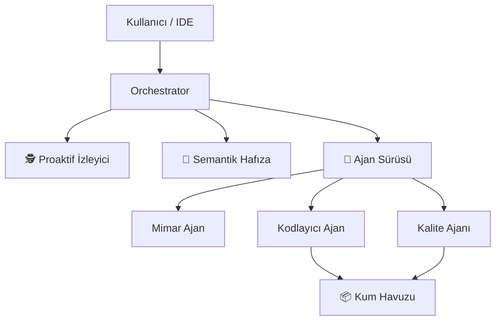

# Deep-Thinker MCP - Tam Otonom Kodlama Ajanı 🚀

**Deep-Thinker MCP**, IDE'nizi (Cursor, VS Code vb.) **Otonom Bir Yazılım Üssüne** dönüştüren devrim niteliğinde bir [Model Context Protocol](https://github.com/modelcontextprotocol) sunucusudur.

Sadece komut bekleyen klasik yapay zekaların aksine, Deep-Thinker **planlar, kodu çalıştırır, öğrenir ve kod tabanınızı proaktif olarak izler**. **GLM-4** modelinin gücünü, gelişmiş bir Ajan (Agent) mimarisiyle birleştirir.

[](https://opensource.org/licenses/MIT)
[](https://nodejs.org/)
[]()

> "Sadece bir asistan değil. Editörünüzün içinde yaşayan proaktif bir kıdemli yazılım mühendisi."

---

## 🌟 Neden bir "Oyun Değiştirici"?

Çoğu AI kodlama aracı **Reaktiftir**: Sen sorarsın, o cevap verir.
Deep-Thinker **Proaktif & Otonomdur**:

1.  **Düşünür:** Karmaşık görevleri alt parçalara böler (`Görev Ayrıştırma`).
2.  **Hatırlar:** Semantik hafıza ile projenizin _niyetini_ anlar.
3.  **İşbirliği Yapar:** Özelleşmiş ajanlardan oluşan bir "Sürü" (Swarm) kurar (Mimar, Kodlayıcı, Testçi).
4.  **İzler:** Siz kod yazarken arkaplanda dosyaları izler ve hataları düzeltebilir.

---

## 🚀 Temel Yetenekler

### 1. 🐝 Sürü Mimarisi (Swarm Architecture)

Neden tek bir AI ile yetinesiniz?

- **Mimar Ajanı (Architect)**: Çözümün mimarisini tasarlar.
- **Kodlayıcı Ajanı (Coder)**: Tasarıma uygun, optimize kodu yazar.
- **Kalite Ajanı (QA)**: Testleri yazar ve kodu doğrular.

```bash
# Örnek
Use delegate_to_swarm: "JWT ile tam kapsamlı bir auth sistemi kur"
# Sonuç: Sürü, tüm özelliği kendi kendine tasarlar, kodlar ve test eder.
```

### 2. 🧠 Semantik Hafıza (RAG-Lite)

"Context window" limitlerini unutun. Deep-Thinker tüm kod tabanınızın _anlamını_ bilir.

- **`index_codebase`**: Projeyi tarar ve özetleyerek vektörel (basit) hafızasına alır.
- **`semantic_search`**: "Ödeme doğrulama mantığı nerede?" diye sorduğunuzda, dosya adı `xyz.js` olsa bile bağlamdan bulur.

### 3. 📦 Kod Çalıştırma Kum Havuzu (Sandbox)

Bozuk kodlara son. Deep-Thinker kodu size sunmadan önce çalıştırıp test eder.

- **`run_in_sandbox`**: Üretilen kod parçacıklarını (Node.js, Python vb.) izole bir ortamda çalıştırır ve doğrular.

### 4. 🕵️ Proaktif İzleyici (Watcher)

Sessiz ortağınız.

- **`start_watcher`**: Arka planda çalışır.
- Dosya değişikliklerini algılar; kaydettiğiniz an sözdizimi kontrolü, güvenlik taraması veya testleri otomatik tetikleyebilir.

---

## 🛠️ Kurulum

```bash
# 1. Repoyu klonlayın
git clone https://github.com/yasinelbuz/glm-think-mcp.git
cd glm-think-mcp

# 2. Bağımlılıkları yükleyin
npm install

# 3. API Anahtarını Ayarlayın
# https://api.z.ai adresinden anahtarınızı alın
```

### Cursor'a Ekleme (Settings > Features > MCP)

```json
{
  "deep-thinking": {
    "command": "node",
    "args": ["C:/path/to/glm-think-mcp/index.js"],
    "env": {
      "GLM_API_KEY": "YOUR_API_KEY_HERE"
    }
  }
}
```

---

## 📚 50+ Özelleşmiş Araç

Modüler mimari üzerine kurulu güçlü araç seti:

| Kategori       | Araçlar                                                              |
| -------------- | -------------------------------------------------------------------- |
| **Otonom**     | `delegate_to_swarm`, `plan_task`, `auto_detect`                      |
| **Hafıza**     | `index_codebase`, `semantic_search`                                  |
| **İzleyici**   | `start_watcher`, `stop_watcher`, `watcher_status`                    |
| **Çalıştırma** | `run_in_sandbox`                                                     |
| **Kodlama**    | `deep_think_code`, `refactor_code`, `find_bugs` (Auto-Fix)           |
| **DevOps**     | `generate_dockerfile`, `k8s_manifest`, `terraform_module`            |
| **DB & Git**   | `analyze_query`, `suggest_indexes`, `pr_review`, `resolve_conflicts` |

---

## 🏗️ Mimari



---

## 🤝 Katkıda Bulun

Yapay zeka devriminin bir parçası olun. PR'larınızı bekliyoruz!

1. Forklayın.
2. Branch oluşturun (`git checkout -b ozellik/yeni-ozellik`).
3. Commit atın.
4. Pushlayın.
5. Pull Request açın.

---

## Lisans

MIT © 2026

